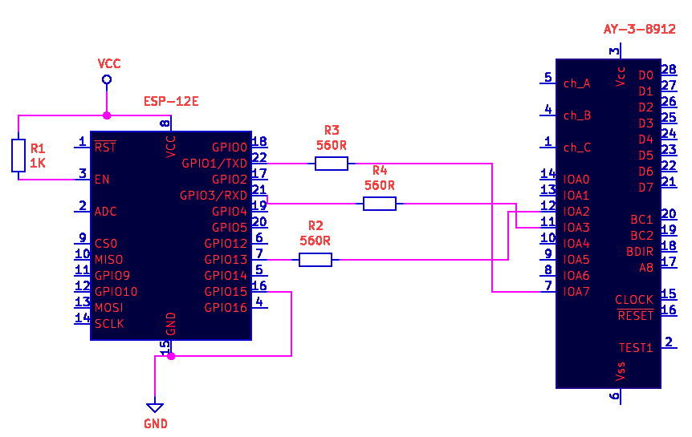

# Wifi for ANY zx with AY sound chip

You should attach ESP chip to your AY following next diagram:

You doesn't need to flash something or change modes via your PC - only attach ESP to good working
 