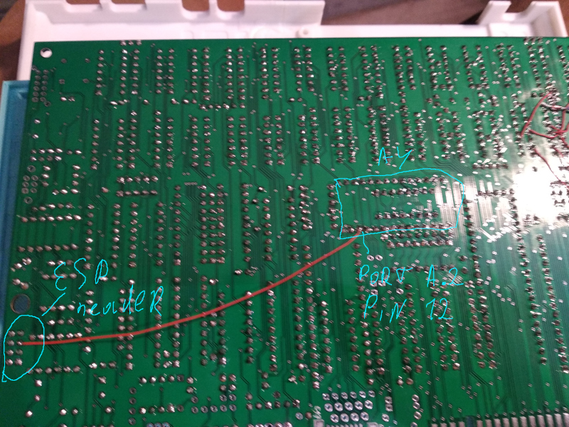
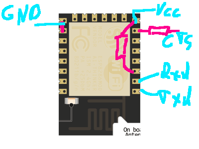
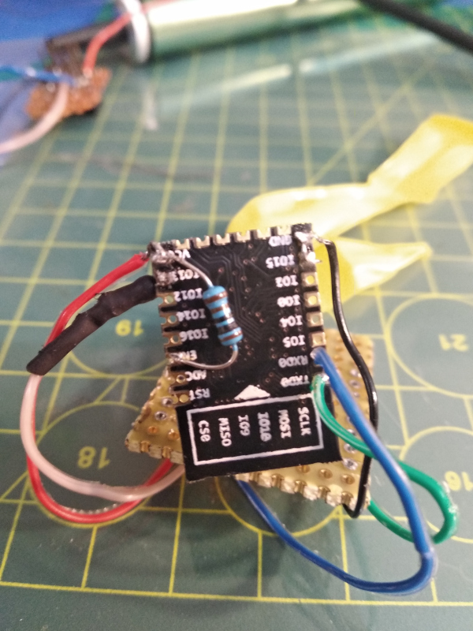
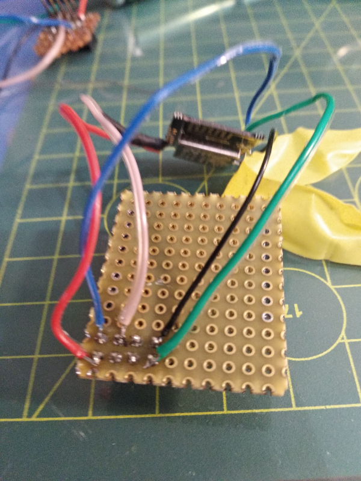
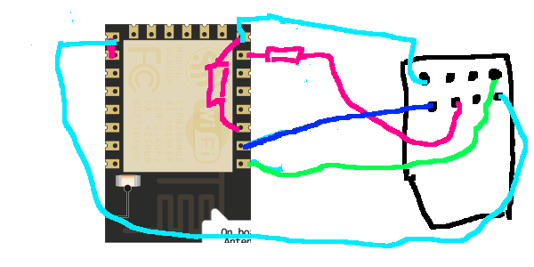

# Wifi for any zx spectrum. Harlequin 128k Edition with divMMC/divIDE(esxDOS)

Modern Harlequin 128K boards have buildin ESP-header for connecting wifi chips.

There wasn't software to use it in full power. With simple mods you'll may use software ports from ZXUno(gopher browser, irc client, web file fetcher, platoTerm will be easly ported). 

## Simplest board modification

ZX Spectrum 128K have CTS signal that's say to device "I'm ready to receive data" - it's makes possible get stable data exchange without losing some data. ESP pin-header doesn't have this signal - first what we do - add this signal to it.

To make this link - connect pin 12 of AY8912 to ESP-header(I'm using GPIO-0 pin of ESP-01).



If you'll try use ESP-01 chip better connect it with 1K resistor(I've added it to "modem's board" - you may put it on speccy's board and remove from modem). 

## Wifi modem

Ok. Your speccy are ready to connect simplest wifi modem. Schematic simple to make and cheap as cup of cofe.

You'll need two 1 kilooms resistors and ESP-12 module.

If you've installed resistor on prev. step(from AY to ESP header) - you need remove resistor from CTS pin. 



You've soldered it? Ok. Make pin-connector to harlequin's board.

I've made it like this:





So you get this schematis:



Better isolate ESP-chip with isolation tape to prevent short circuits.

So if you made all this steps - you're ready to begin your wifi on speccy experience.

## Software part.

Extract this [archive from latest release](https://github.com/nihirash/zx-net-tools/releases/) to root of your memory card(or hard drive, if you using esxDOS with divIDE and hard drive).

First that you must run is setspeed.tap file that placed in network folder - it change ESP-12 chip speed from 115200 without controll flow to 9600 with CTS flow control. 

After it you may configure your access point. Just enter in basic

```
.iwconfig YOUR-SSID PASSWORD
```

Replace YOUR-SSID and PASSWORD with your ssid and password. 

So, it's time to try it with gopher-browser - run it(`network/gopher/ugoph.bas` file).

If all made right - it will download welcome page with key description and copyright notice. 

So - you may browse gopher sites, hear AY-music online, see speccy's screens and download games.

My gopher server contains ton of this things.

Feel free to contact me for any questions: 

 * anihirash@gmail.com
 * @nihirash at telegram/github/twitter

You also may support my work via [PayPal.Me page](https://paypal.me/pinport)